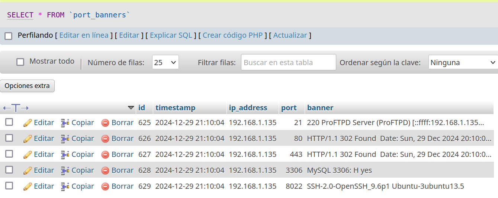
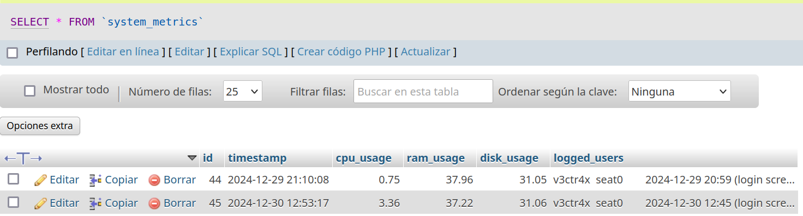

Introduction to Moon IDS: Real-Time Network Monitoring and Scanning System

Moon IDS is an advanced port scanning and network monitoring tool designed to provide real-time visibility into the status of services and ports on machines across a network. The system integrates scanning capabilities, service identification, and security analysis into an intuitive web-based platform. Using modern technologies like Express and React for the web interface and a robust backend written in C, Moon IDS offers a comprehensive and efficient solution for system administrators and IT security teams.
Current Features:

    Port Scanning: The core feature of Moon IDS is its ability to quickly and efficiently scan ports within a specified IP address range. Administrators can define port ranges to check whether ports are open or closed, helping to identify unauthorized access points or vulnerabilities in the network infrastructure.

    Service Identification: Currently, the system can identify several common services running on specific ports, such as HTTP (port 80), HTTPS (port 443), FTP (port 21), SSH (port 22), Tor, and Minecraft. By retrieving service banners, Moon IDS provides valuable information on the software running on a given port, which can be crucial for administrators and security teams.

# Future Goals:

To further enhance monitoring and security capabilities, Moon IDS is designed to evolve into a more robust platform, including the following future features:

    Real-Time Monitoring: The system aims to add the capability to monitor services and hosts in real time. This will involve running periodic full scans and continuously verifying the integrity of monitored systems. Administrators will receive immediate alerts and reports about any detected changes or anomalies.

    Advanced Security Analysis: Security will be a major focus in the future development of the system. Moon IDS will allow for scans to detect unauthorized changes in critical files and directories, analyze system logs, and provide a clear picture of the security status of machines on the network.

    Intrusion Detection and DDoS Attack Detection: One of the most ambitious future features will be real-time network traffic analysis to detect potential Denial of Service (DDoS) attacks or infiltrations within machines. By integrating traffic analysis technologies and monitoring critical command logs (such as sudo logs), Moon IDS will offer an additional layer of protection against advanced threats.

# Technologies Used:

    Backend in C: The core of the scanning and network analysis is developed in C, ensuring high performance and efficiency when handling low-level operations and network-intensive tasks.

    Frontend in React: The web interface is built using React to provide a dynamic, interactive user experience. Users will be able to view real-time statistics and data, with interactive charts and automatic alerts.

    Express Server: The system uses Express, a minimalistic Node.js framework, to manage interactions between the frontend and backend, ensuring an efficient, high-performance web server.


# Database

The database will be MySQL, then I will pass the SQL code to set it up

```SQL
CREATE DATABASE moon;

USE moon;

-- Tabla para métricas del sistema
CREATE TABLE system_metrics (
    id INT AUTO_INCREMENT PRIMARY KEY,
    timestamp DATETIME DEFAULT CURRENT_TIMESTAMP,
    cpu_usage FLOAT,
    ram_usage FLOAT,
    disk_usage FLOAT,
    logged_users TEXT
);

-- Tabla para puertos y banners
CREATE TABLE port_banners (
    id INT AUTO_INCREMENT PRIMARY KEY,
    timestamp DATETIME DEFAULT CURRENT_TIMESTAMP,
    ip_address VARCHAR(50),
    port INT,
    banner TEXT
);
```

# Dependencies

To use the project you must have the following dependencies installed:

`libssl-dev`

`libssh-dev`

`libmysqlclient-dev`

`gcc`

# 

How to install it in the different Linux distributions:

### **Ubuntu/Debian based distros**

```bash
sudo apt update && sudo apt install libssl-dev libssh-dev libmysqlclient-dev gcc -y
```

### **Fedora based distros** 

```bash
sudo dnf update && sudo dnf install openssl-devel libssh-devel mysql-devel gcc
```

### **Arch linux based distros**

```bash
sudo pacman -Syu && sudo pacman -S openssl libssh mysql --noconfirm
```
# Compilation

We have a `Makefile`, when compiling the project, it takes the files inside the `src/` directory to compile it and take it to `target/release/`

```bash
make
```

to clean the executable files use:

```bash
make clean
```

# Usage 

### Moon (Client)

Moon is the client, send all the parametres to your localhost or any host MYSQL instance (for now only MySQL, in the future i will put more DB Compatibility)

```bash
./moon -i 192.168.1.135 -s 1 -e 10000 -r 127.0.0.1 -p 12345 -b
```

```bash
./moon -i 192.168.1.135 -s 1 -e 10000 -r 127.0.0.1 -p 12346 -m
```

To understand how the client works, this goes like this: 

```bash
moon -i <ip> -s <start-port> -e <end-port> -r <ip-server> -p <port to which it measures> -b (banner) -m (system-metrics)
```

### Receptors (Server)

The servers (there are 2) have the function of analyzing all the information that arrives to enter it into the database in an orderly manner.

One server is a banner server on port 12345 and another metrics server on port 12346. Here is a capture of the logs

```bash
➤ ./receptor-banner
Receptor escuchando en el puerto 12345...
Conexión aceptada desde 127.0.0.1:46840
Datos completos recibidos:
Puerto 21 abierto en 192.168.1.135
220 ProFTPD Server (ProFTPD) [::ffff:192.168.1.135]
Puerto 80 abierto en 192.168.1.135
HTTP/1.1 302 Found  Date: Sun, 29 Dec 2024 20:10:03 GMT  Server: Apache/2.4.56 (Unix) OpenSSL/1.1.1t PHP/8.2.4 mod_perl/2.0.12 Perl/v5.34.1  X-Powered-By: PHP/8.2.4  Location: http://localhost/dashboard/  Content-Length: 0  Content-Type: text/html; charset=UTF-8    
Puerto 443 abierto en 192.168.1.135
HTTP/1.1 302 Found  Date: Sun, 29 Dec 2024 20:10:03 GMT  Server: Apache/2.4.56 (Unix) OpenSSL/1.1.1t PHP/8.2.4 mod_perl/2.0.12 Perl/v5.34.1  X-Powered-By: PHP/8.2.4  Location: https://localhost/dashboard/  Content-Length: 0  Content-Type: text/html; charset=UTF-8    
Puerto 3306 abierto en 192.168.1.135
MySQL 3306: H yes
Puerto 8022 abierto en 192.168.1.135
SSH-2.0-OpenSSH_9.6p1 Ubuntu-3ubuntu13.5  

#Here analize the logs to introduce in the database

Procesando línea: Puerto 21 abierto en 192.168.1.135
Puerto 21 abierto en IP 192.168.1.135
Procesando línea: 220 ProFTPD Server (ProFTPD) [::ffff:192.168.1.135]
Banner adicional recibido: 220 ProFTPD Server (ProFTPD) [::ffff:192.168.1.135]
Banner del puerto insertado correctamente.
Procesando línea: Puerto 80 abierto en 192.168.1.135
Puerto 80 abierto en IP 192.168.1.135
Procesando línea: HTTP/1.1 302 Found  Date: Sun, 29 Dec 2024 20:10:03 GMT  Server: Apache/2.4.56 (Unix) OpenSSL/1.1.1t PHP/8.2.4 mod_perl/2.0.12 Perl/v5.34.1  X-Powered-By: PHP/8.2.4  Location: http://localhost/dashboard/  Content-Length: 0  Content-Type: text/html; charset=UTF-8    
Banner adicional recibido: HTTP/1.1 302 Found  Date: Sun, 29 Dec 2024 20:10:03 GMT  Server: Apache/2.4.56 (Unix) OpenSSL/1.1.1t PHP/8.2.4 mod_perl/2.0.12 Perl/v5.34.1  X-Powered-By: PHP/8.2.4  Location: http://localhost/dashboard/  Content-Length: 0  Content-Type: text/html; charset=UTF-8    
Banner del puerto insertado correctamente.
Procesando línea: Puerto 443 abierto en 192.168.1.135
Puerto 443 abierto en IP 192.168.1.135
Procesando línea: HTTP/1.1 302 Found  Date: Sun, 29 Dec 2024 20:10:03 GMT  Server: Apache/2.4.56 (Unix) OpenSSL/1.1.1t PHP/8.2.4 mod_perl/2.0.12 Perl/v5.34.1  X-Powered-By: PHP/8.2.4  Location: https://localhost/dashboard/  Content-Length: 0  Content-Type: text/html; charset=UTF-8    
Banner adicional recibido: HTTP/1.1 302 Found  Date: Sun, 29 Dec 2024 20:10:03 GMT  Server: Apache/2.4.56 (Unix) OpenSSL/1.1.1t PHP/8.2.4 mod_perl/2.0.12 Perl/v5.34.1  X-Powered-By: PHP/8.2.4  Location: https://localhost/dashboard/  Content-Length: 0  Content-Type: text/html; charset=UTF-8    
Banner del puerto insertado correctamente.
Procesando línea: Puerto 3306 abierto en 192.168.1.135
Puerto 3306 abierto en IP 192.168.1.135
Procesando línea: MySQL 3306: H yes
Banner adicional recibido: MySQL 3306: H yes
Banner del puerto insertado correctamente.
Procesando línea: Puerto 8022 abierto en 192.168.1.135
Puerto 8022 abierto en IP 192.168.1.135
Procesando línea: SSH-2.0-OpenSSH_9.6p1 Ubuntu-3ubuntu13.5  
Banner adicional recibido: SSH-2.0-OpenSSH_9.6p1 Ubuntu-3ubuntu13.5  
Banner del puerto insertado correctamente.
Conexión cerrada por el cliente
```

```bash
➤ ./receptor-metricas
Hilo de métricas iniciado...
Escuchando métricas en el puerto 12346...
Datos de métricas recibidos:
==== Banner del Sistema ====
Uso del procesador: 0.75%
[DEBUG] Memoria total: 7302 MB, Memoria usada: 2772 MB, Uso de RAM: 37.96%
Uso de RAM: 37.96%
Uso de disco: 31.05%
Usuarios conectados:
v3ctr4x  seat0        2024-12-29 20:59 (login screen)
v3ctr4x  tty2         2024-12-29 20:59 (tty2)
============================

Métricas del sistema insertadas correctamente.
```


# Media



Port banner example




System-metrics example


